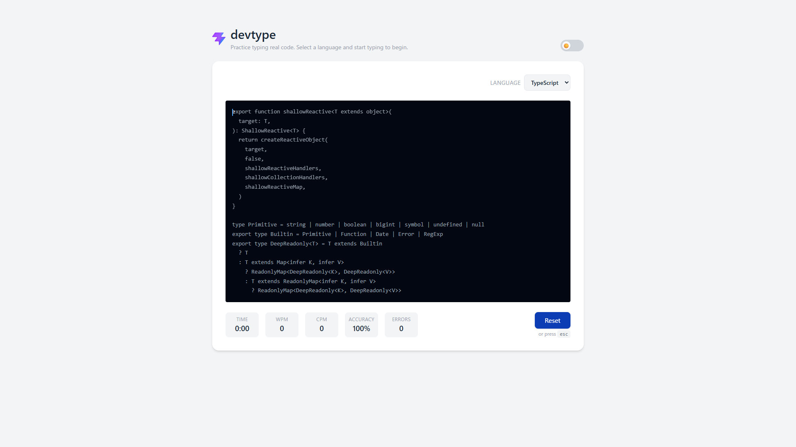

# devtype
A developer-focused typing speed test built with React and TypeScript. Choose a language, type real code snippets, and track your WPM, CPM, and accuracy.

🔗 **[Live Demo](https://devtype-sand.vercel.app/)**



## Features
- Real code snippets fetched from the GitHub API
- Supports 11 programming languages
- Tracks WPM, CPM, and accuracy in real time
- Error blocking — must backspace to correct mistakes
- Invisible input with cursor indicator for a clean typing experience
- Auto-skips indentation on Enter
- Fallback snippets when GitHub API is unavailable

## Tech Stack
- React
- TypeScript
- Tailwind CSS
- Vite

## Getting Started
```bash
git clone https://github.com/Koji1999/devtype
cd devtype
npm install
npm run dev
```

Open [http://localhost:5173](http://localhost:5173) in your browser.